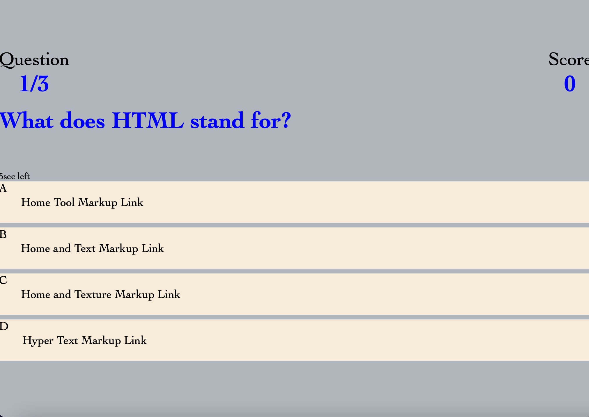

# codequiz
Code Quiz For Challenge 4

# Description 
I have created a 3 questioned HTML beginner quiz with a 15 second timer. The questions are for beginners that are learning to code. The quiz contains 3 questions all are which are multiple choice. The user has 15 seconds to answer 3 of the HTML questions, if they get the question right the score will appear in the upper right hand side 1. If they get the question wrong it will minus the score. So if you get all 3 wrong, it will be a minus 3 score. If you run out of time you will be prompt back to the beginning. Keep in mind these are very simple questions. TIME STARTS NOW!

# Visual 
<<<<<<< HEAD

=======

>>>>>>> fb050f4710d28a486a4a415cfce8c34668d9d915

# Links To Github and Live Site 
[Live Portfolio Webpage]()

[Github Link](https://github.com/ajenkinsynwa/codequiz-)
